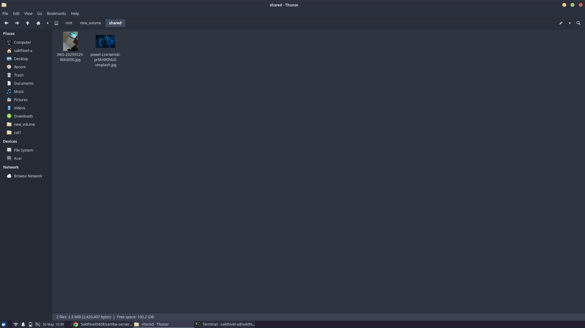

# 🌐 Samba Server Setup on Linux

This project documents the setup and configuration of a **Samba server** on a Linux laptop to enable file sharing across local devices, including a **Samsung Android phone**.

---

## 🛠️ Project Overview

- **Platform**: Linux (tested on Ubuntu/Debian)
- **Service Used**: Samba
- **Goal**: Share a local folder over the network to mobile and PC clients
- **Accessed From**: Samsung mobile (via My Files > Network Storage)

---

## 🔧 Installation Steps

### 1. Install Samba

```bash
sudo apt update
sudo apt install samba samba-common-bin
```

### 2. Create a Shared Directory

```bash
mkdir -p ~/shared
chmod -R 777 ~/shared
```

### 3. Configure Samba (`/etc/samba/smb.conf`)

Append this to the bottom of your config file:

```ini
[Shared]
   path = /mnt/new_volume/shared
   browseable = yes
   writable = yes
   guest ok = yes
   force user = sakthivel-a
```

> Replace `/mnt/new_volume/shared` with your actual path.

---

## 📱 Access from Samsung Mobile

On your Android phone:

- Open **My Files**
- Tap **Network Storage** > Add Network Storage
- Choose **SMB**
- Enter your laptop’s **IP address**, username and password
- You can now access the shared folder 

---


## 🖼️ Screenshots

| Description            | Screenshot                            |
|------------------------|----------------------------------------|
| Shared Folder on Laptop(server)  |  |
| Shared Folder on Phone |       |

---

## 📋 Notes

- Make sure the `smbd` service is running:
  ```bash
  sudo systemctl restart smbd
  sudo systemctl status smbd
  ```
- Use `ip a` or `hostname -I` to get your laptop's local IP

---


## 📜 License

This project is open-source under the [MIT License](LICENSE).

---

## 🙌 Author

Maintained by **[Sakthivel A](https://github.com/Sakthi0408)**  
📧 asakthivel0408@gmail.com
